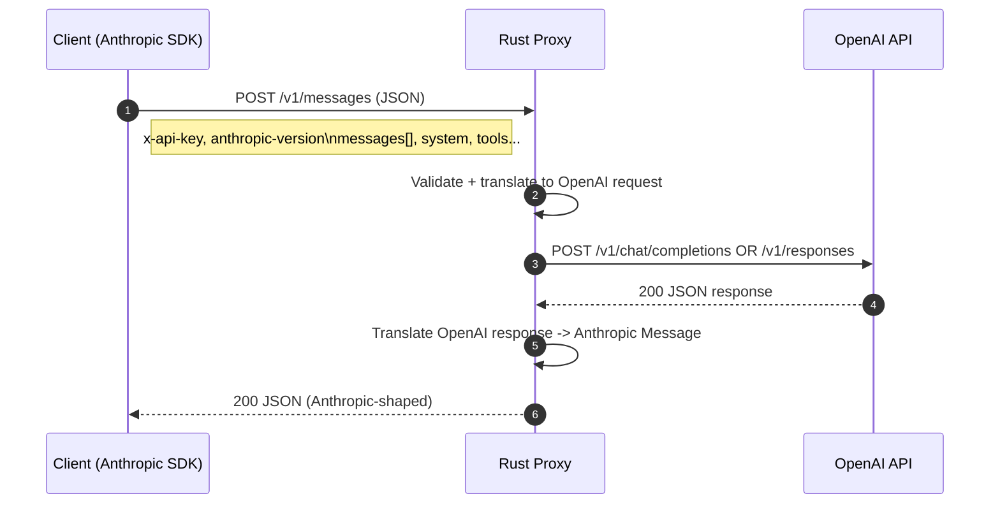
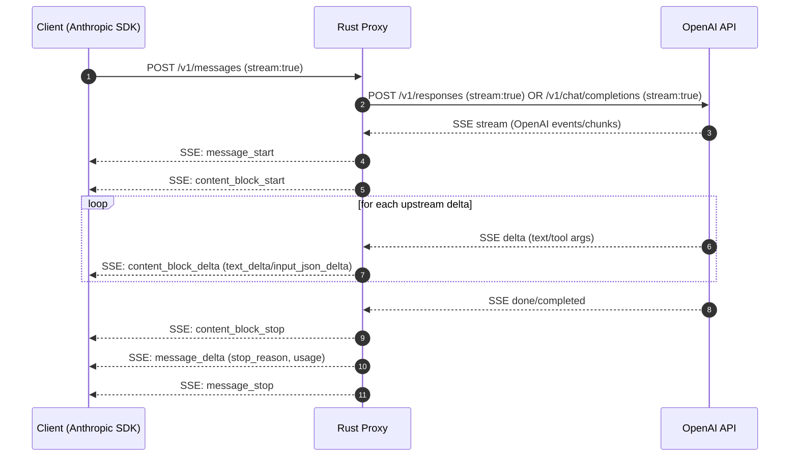

# Deep Research Report: Building a Rust Proxy That Translates Anthropic Calls to the OpenAI API Spec

## Executive summary

A Rust “translation proxy” that lets developers keep *Anthropic-style* client code while executing requests against *OpenAI-style* APIs is feasible, but “perfect” 1:1 compatibility is not. The hard parts are (a) **streaming semantics and SSE chunk formats**, (b) **tool / function call representations** (Anthropic content blocks vs OpenAI tool_calls + tool messages), (c) **token accounting + limits** (different tokenization and “max tokens” semantics), and (d) **provider-specific features** like Anthropic prompt caching, PDFs/citations, and “pause_turn,” versus OpenAI Responses’ semantic event model, WebSocket mode, MCP tools, and skills. citeturn6view1turn5view0turn30view0turn32view0

A robust approach is to implement:

- A **frontend** that speaks *Anthropic* HTTP routes (`POST /v1/messages`, plus optional `/v1/messages/count_tokens`, `/v1/models`, `/v1/messages/batches`, beta `/v1/files`, beta `/v1/skills`). citeturn6view0turn9view8turn34view0turn34view4  
- A **backend adapter** that calls *OpenAI* endpoints (preferably `/v1/responses` where possible, with a fallback to `/v1/chat/completions` for features that map more cleanly, like `stop`). citeturn7view0turn7view1turn5view0  
- A **bidirectional translator**:
  - Anthropic request → OpenAI request  
  - OpenAI response/stream → Anthropic response/stream  
- A **capabilities layer** that decides, per request, whether to use OpenAI Responses vs Chat Completions, and how to degrade/approximate unsupported features while being explicit in metadata and logs.

This report provides: (1) a detailed spec comparison, (2) an inventory of major divergent LLM API specs, (3) translation-relevant diffs, (4) a Rust architecture proposal, (5) concrete project structure + code-level design, (6) milestones + CI/CD guidance, and (7) security/performance/compatibility + migration guidance, including endpoint/field mapping tables and Mermaid sequence diagrams.

## OpenAI vs Anthropic API specs

### Endpoints, routes, methods, and “what is the primary text-generation API?”

**Anthropic (Claude API) — primary text endpoint**
- `POST /v1/messages` (Messages API) produces a “Message” object with `content` as an array of typed blocks and `stop_reason`. citeturn9view8turn6view0turn6view0  
- Additional first-party endpoints that matter for a proxy:
  - Token counting: `POST /v1/messages/count_tokens` citeturn6view0  
  - Models listing: `GET /v1/models` citeturn6view0  
  - Async batching: `POST /v1/messages/batches` citeturn6view0  
  - Beta Files: `POST /v1/files`, `GET /v1/files` (beta header required) citeturn6view0turn34view2turn34view0  
  - Beta Skills: `POST /v1/skills`, `GET /v1/skills`, etc. citeturn6view0turn34view4turn34view1  

**OpenAI — primary text endpoints (today)**
- `POST /responses` (“Creates a model response”) — current flagship interface and foundation for “semantic event” streaming. citeturn7view0turn5view0  
- `POST /chat/completions` — supported, common, explicitly described as “starting a new project? try Responses,” but still heavily used and has its own streaming delta format. citeturn7view1turn5view0  
- There are also platform APIs (Files, Uploads, etc.) that may or may not be relevant depending on how much of the Anthropic surface area you want to proxy:
  - File upload: `POST /v1/files` uses multipart form data (`-F file=@...`). citeturn7view11  
  - Rate limits in headers: OpenAI documents a set of `x-ratelimit-*` headers. citeturn15view0  
  - Realtime/WebSocket mode for `/v1/responses` exists (persistent socket + incremental inputs). citeturn30view0turn3view10  

**Proxy implication:** If your frontend is Anthropic Messages, you need a deterministic mapping to either:
- OpenAI **Chat Completions** (closest “messages[]” mental model, includes `stop` and `max_tokens`), or
- OpenAI **Responses** (more modern; supports built-in tools and MCP tools; different input schema; richer streaming event model). citeturn7view1turn7view0turn5view0turn12view7  

A production proxy usually implements **both** and selects at runtime.

### Authentication and required headers

**Anthropic**
- Requires headers: `x-api-key`, `anthropic-version`, and `content-type: application/json` (for JSON endpoints). citeturn6view0  
- Beta features are negotiated via `anthropic-beta` header and sometimes `?beta=true` on endpoints (e.g., Files/Skills). citeturn34view0turn34view1turn34view2  

**OpenAI**
- Uses `Authorization: Bearer $OPENAI_API_KEY` for REST calls (visible in multiple official examples). citeturn10view5turn7view11turn30view0  
- Rate limit metadata is returned in `x-ratelimit-*` headers. citeturn15view0  

**Proxy implication:** You must decide whether the proxy:
- Accepts *Anthropic* client headers (`x-api-key`, `anthropic-version`) and maps them to a configured OpenAI key, or
- Accepts an OpenAI bearer token from clients, or
- Supports **both**, with predictable precedence and auditing controls.

### Message/request schema comparison

#### Text generation request

**Anthropic Messages (`POST /v1/messages`)**
Core fields include:
- `model` (Claude model name) citeturn6view0turn9view9  
- `max_tokens` (required) citeturn7view2turn6view0  
- `messages`: array of `{role, content}` citeturn7view2turn6view0  
- `system`: *separate* top-level field (string or array of text blocks) citeturn7view3  
- `stream`: boolean (SSE streaming) citeturn7view5turn6view1  
- Sampling controls: `temperature` (0..1), `top_p` (0..1), `stop_sequences` (array) citeturn8view0turn8view1turn8view2  
- Tooling: `tools` and `tool_choice` (supports “any/tool/none” and parallel tool use controls) citeturn9view11turn8view3turn31view2  
- `metadata` (includes `user_id`) and `inference_geo` (data residency control). citeturn9view9turn8view4turn6view0  
- Optional “extended thinking” configuration via `thinking`. citeturn31view6turn8view0  

Anthropic message **content** is a typed block array (text, image, document, tool_use, tool_result, etc.). For example, documents can include PDFs (`media_type: application/pdf`) as base64 sources. citeturn31view9turn8view8turn8view7  

**OpenAI Chat Completions (`POST /chat/completions`)**
Core fields include:
- `model` (OpenAI model family; roles include `developer` and `system`) citeturn7view1turn7view9  
- `messages`: list of role messages; for “o1 models and newer,” developer messages replace system messages for highest-priority instruction. citeturn7view9  
- `stream`: boolean; streaming uses SSE with chunk objects (`chat.completion.chunk`) and ends with `data: [DONE]`. citeturn10view0turn11view0turn11view2turn10view7  
- Sampling controls: `temperature` (0..2), `top_p` (0..1), `stop` (string or string array, up to 4). citeturn11view0turn10view2turn11view2  
- `max_tokens` present (legacy naming; still used). citeturn10view6turn11view1  
- Tool calling: `tools`, `tool_choice`; tools include function tools and “custom” tools in this spec. citeturn10view1turn10view4turn11view0  
- Other controls: `presence_penalty`, `frequency_penalty`, `response_format` (structured outputs via JSON Schema), and additional IDs like `safety_identifier` / `prompt_cache_key`. citeturn11view3turn11view4turn11view5turn11view8  
- Streaming “obfuscation” option exists to normalize payload sizes as a mitigation for certain side-channel attacks. citeturn10view0  

**OpenAI Responses (`POST /responses`)**
Key ideas:
- Input may be a simple string or a rich list of input items including text, images, and *files* (`input_file` with `file_data`, `file_id`, or `file_url`). citeturn12view5turn9view5turn12view9  
- Instruction hierarchy is explicit in some schemas (system/developer/user roles). citeturn12view4  
- Streams “semantic events” such as `response.output_text.delta` and `response.completed`. citeturn5view0turn12view11  
- Supports built-in tools (web search, file search) and MCP tools (including third-party connectors). citeturn12view7turn7view0  

#### Model naming

- Anthropic model names are distinct and often versioned (examples in official docs include `claude-opus-4-6`, and many `claude-3-*` variants). citeturn6view0turn9view9  
- OpenAI model names are distinct (examples shown include `gpt-5`, `gpt-5.4`, `gpt-4.1`, and others). citeturn5view0turn10view6turn9view1  

**Proxy implication:** Treat model mapping as configuration (aliases), not hard-coded logic. Model families have different capabilities (vision, tool calling, long context, etc.), so a naive “string replace” mapping causes subtle failures.

### Tool / function calling semantics

**Anthropic**
- Tool use appears in *assistant output* as `tool_use` content blocks with `{id, name, input}`; tool results are returned in a follow-up *user* message as `tool_result` blocks referencing `tool_use_id`. citeturn31view1turn31view2turn6view1  
- `tool_choice` can force tool use and can disable parallel tool use. citeturn8view3turn9view11  
- Streaming for tool calls includes `input_json_delta` partial JSON strings for tool inputs. citeturn6view1  

**OpenAI Chat Completions**
- Tool calls are represented as `tool_calls` produced in the assistant message; the tool call object includes a `function` with JSON arguments (string) and a call `id`. citeturn10view4turn11view2  
- When streaming, deltas can include tool call fields; completion ends with `finish_reason: "tool_calls"` for tool invocation. citeturn11view2turn10view7  
- `response_format` supports Structured Outputs with JSON Schema. citeturn11view5  

**OpenAI Responses**
- Designed to support tool calling and tool events in a semantic event stream; streaming includes event types for function call argument deltas/done, etc. citeturn5view0turn12view11turn5view0  
- Supports built-in tools and MCP tools, including integrations via MCP servers and connectors. citeturn12view7turn7view0turn3view11  

**Proxy implication:** You must implement:
1) a *lossless ID bridge* (Anthropic `tool_use.id` ↔ OpenAI `tool_call.id` / Responses `call_id`), and  
2) a *schema transformation* (Anthropic tool `input` is JSON object; OpenAI function `arguments` often delivered as JSON string, possibly partial deltas). citeturn31view1turn10view4turn6view1turn5view0  

### Streaming vs non-streaming: protocols and chunk formats

#### Anthropic streaming (SSE)

With `stream: true`, Anthropic uses SSE with a documented event flow:
- `message_start`
- per content block: `content_block_start` → repeated `content_block_delta` → `content_block_stop`
- (optional) `message_delta`
- `message_stop` citeturn6view1  

Delta types include:
- `text_delta` for text
- `input_json_delta` for tool inputs (partial JSON)
- `thinking_delta` when extended thinking is enabled citeturn6view1turn31view6  

#### OpenAI streaming (SSE)

Two major formats:

1) **Chat Completions streaming**: returns incremental chunk objects; `delta` holds role/content/tool deltas; ends with `data: [DONE]`. citeturn5view0turn10view7turn11view0turn11view2  

2) **Responses streaming**: uses semantic events (`response.created`, `response.output_text.delta`, `response.completed`, etc.). The Responses create/reference content includes example events like `response.output_text.delta` and `response.output_text.done`. citeturn5view0turn12view11  

OpenAI also documents **WebSocket mode** for `/v1/responses` for long-running workflows; it includes a JSON error shape used on the socket transport. citeturn30view0turn3view10  

**Proxy implication:** Streaming translation is the core engineering risk. You’ll need:
- SSE parser for upstream OpenAI events/chunks  
- SSE emitter for downstream Anthropic events  
- Backpressure handling so slow downstream clients don’t cause unbounded buffering.

### Errors, status codes, and rate limits

#### Anthropic errors and request size

Anthropic documents:
- Standard HTTP errors: 400 invalid_request_error, 401 authentication_error, 413 request_too_large (max 32 MB on standard endpoints), 429 rate_limit_error, 529 overloaded_error, etc. citeturn28view0turn6view0  
- Error shape always JSON with top-level `{type: "error", error: {type, message}, request_id}`. citeturn28view0  
- Request size limits vary by endpoint (Messages 32 MB, Batch 256 MB, Files 500 MB). citeturn28view0turn6view0  

Rate limiting headers (examples):
- `anthropic-ratelimit-requests-*`, `anthropic-ratelimit-tokens-*`, plus `retry-after`. citeturn13view0turn13view1  

#### OpenAI errors and rate limits

OpenAI documents:
- Rate limit measurement dimensions and **rate limit headers**: `x-ratelimit-limit-requests`, `x-ratelimit-remaining-tokens`, `x-ratelimit-reset-*`, etc. citeturn15view0  
- WebSocket mode includes JSON error examples (top-level `type: "error"` and an `error` object with `code`, `message`, `param`, plus `status`). citeturn30view0  
- Chat Completions response `finish_reason` values explicitly include `"stop"`, `"length"`, `"tool_calls"`, and `"content_filter"` (plus deprecated `"function_call"`). citeturn11view2  
- Responses create reference includes a `ResponseError` with codes like `rate_limit_exceeded` and others. citeturn12view10turn7view0  

**Proxy implication:** Decide a deterministic mapping:
- Upstream OpenAI HTTP errors → downstream Anthropic error schema (and vice versa if you ever reverse direction)
- Map OpenAI `x-ratelimit-*` → Anthropic `anthropic-ratelimit-*` if you want Anthropic clients to maintain their existing rate-limit logic.

### Multipart/file uploads and “files in prompts”

**OpenAI**
- File upload uses multipart form data (`POST /v1/files`) in official examples. citeturn7view11  
- Responses input supports file references (`input_file`) via `file_data`, `file_id`, or `file_url`. citeturn12view9turn12view5  
- OpenAI also supports advanced transports (Realtime/WebSockets) and specialized tools, but those aren’t directly part of the Anthropic Messages surface. citeturn14search12turn30view0turn3view10  

**Anthropic**
- Beta Files API supports multipart upload (`Content-Type: multipart/form-data`) with beta headers. citeturn34view0turn34view2  
- Messages content can include images and PDFs as base64/URL sources; documents include base64 PDFs. citeturn8view8turn8view7turn31view9  
- Files API is beta and explicitly not eligible for ZDR in the docs. citeturn34view2  

**Proxy implication:** You can support *document-in-prompt* in two ways:
1) **Inline**: convert Anthropic document blocks (base64 PDF) to OpenAI Responses `input_file.file_data` (base64). citeturn8view8turn12view9  
2) **Upload + reference**: upload to OpenAI Files first, then pass `file_id` to Responses input. This adds latency and cost and complicates error handling.

## Concrete equivalence examples

This section shows equivalent operations with concrete request/response pairs (JSON + SSE examples), and then describes the translation logic needed in a proxy.

### Basic non-streaming “chat turn”

**Anthropic request (Messages)** citeturn6view0turn9view8

```http
POST https://api.anthropic.com/v1/messages
x-api-key: $ANTHROPIC_API_KEY
anthropic-version: 2023-06-01
content-type: application/json

{
  "model": "claude-opus-4-6",
  "max_tokens": 256,
  "system": "You are a concise assistant.",
  "messages": [
    { "role": "user", "content": "Explain what an LLM proxy does." }
  ]
}
```

**Anthropic response (simplified)** citeturn6view0

```json
{
  "id": "msg_01XFDUDYJgAACzvnptvVoYEL",
  "type": "message",
  "role": "assistant",
  "content": [{ "type": "text", "text": "..." }],
  "model": "claude-opus-4-6",
  "stop_reason": "end_turn",
  "usage": { "input_tokens": 12, "output_tokens": 8 }
}
```

**OpenAI equivalent using Chat Completions** citeturn7view1turn10view5turn11view0turn11view2

```http
POST https://api.openai.com/v1/chat/completions
Authorization: Bearer $OPENAI_API_KEY
Content-Type: application/json

{
  "model": "gpt-5.4",
  "messages": [
    { "role": "developer", "content": "You are a concise assistant." },
    { "role": "user", "content": "Explain what an LLM proxy does." }
  ],
  "max_tokens": 256,
  "temperature": 0.3
}
```

**OpenAI response (simplified)** citeturn11view2turn10view6

```json
{
  "id": "chatcmpl-...",
  "object": "chat.completion",
  "model": "gpt-5.4",
  "choices": [
    {
      "index": 0,
      "message": { "role": "assistant", "content": "..." },
      "finish_reason": "stop"
    }
  ],
  "usage": { "prompt_tokens": 42, "completion_tokens": 93, "total_tokens": 135 }
}
```

**Proxy mapping notes**
- Anthropic `system` → OpenAI `developer` message (or `system` depending on model family; OpenAI docs note precedence differences). citeturn7view9turn7view3  
- Anthropic `max_tokens` → OpenAI `max_tokens` *(Chat Completions)* or `max_output_tokens` *(Responses; if you choose that route)*. citeturn7view2turn12view1  
- Anthropic `stop_reason: "end_turn"` ↔ OpenAI `finish_reason: "stop"`. citeturn31view4turn11view2  
- Token usage fields do not align 1:1 and can’t be made identical; Anthropic notes its token accounting is not a direct reflection of visible content. citeturn31view7  

### Tool invocation / function calling

**Anthropic: tools → `tool_use` block** citeturn31view1turn31view2turn8view3

Request:

```json
{
  "model": "claude-opus-4-6",
  "max_tokens": 512,
  "messages": [
    { "role": "user", "content": "What is the S&P 500 at today?" }
  ],
  "tools": [
    {
      "name": "get_stock_price",
      "description": "Get the latest price for an index or ticker.",
      "input_schema": {
        "type": "object",
        "properties": { "ticker": { "type": "string" } },
        "required": ["ticker"]
      }
    }
  ],
  "tool_choice": { "type": "any" }
}
```

Response content contains:

```json
[
  {
    "type": "tool_use",
    "id": "toolu_01D7FLrfh4GYq7yT1ULFeyMV",
    "name": "get_stock_price",
    "input": { "ticker": "^GSPC" }
  }
]
```

Client then returns a `tool_result`:

```json
{
  "role": "user",
  "content": [
    {
      "type": "tool_result",
      "tool_use_id": "toolu_01D7FLrfh4GYq7yT1ULFeyMV",
      "content": "259.75 USD"
    }
  ]
}
```

**OpenAI Chat Completions: tools → `tool_calls`** citeturn10view1turn10view4turn11view2

Request:

```json
{
  "model": "gpt-5.4",
  "messages": [{ "role": "user", "content": "What is the S&P 500 at today?" }],
  "tools": [
    {
      "type": "function",
      "function": {
        "name": "get_stock_price",
        "description": "Get the latest price for an index or ticker.",
        "parameters": {
          "type": "object",
          "properties": { "ticker": { "type": "string" } },
          "required": ["ticker"]
        }
      }
    }
  ],
  "tool_choice": "auto"
}
```

Response (simplified shape; tool call arguments are a JSON string):

```json
{
  "choices": [
    {
      "message": {
        "role": "assistant",
        "tool_calls": [
          {
            "id": "call_123",
            "type": "function",
            "function": {
              "name": "get_stock_price",
              "arguments": "{\"ticker\":\"^GSPC\"}"
            }
          }
        ]
      },
      "finish_reason": "tool_calls"
    }
  ]
}
```

**Proxy mapping notes**
- Anthropic tool definition:
  - `input_schema` → OpenAI `function.parameters` JSON Schema. citeturn31view2turn10view1  
- Anthropic `tool_use.input` is an object; OpenAI `arguments` is typically a JSON string and may be invalid JSON; proxy should validate/parse defensively. citeturn10view4turn6view1  
- ID strategy recommendation:
  - Use OpenAI `tool_call.id` as the Anthropic `tool_use.id` so that subsequent `tool_result.tool_use_id` can be mapped back to the OpenAI tool call with no server-side session storage.

### Streaming equivalence (SSE)

**Anthropic streaming events** citeturn6view1

Example event frames:

```text
event: message_start
data: {"type":"message_start","message":{"id":"msg_...","type":"message","role":"assistant","content":[],"model":"claude-opus-4-6","stop_reason":null,"stop_sequence":null,"usage":{"input_tokens":25,"output_tokens":1}}}

event: content_block_start
data: {"type":"content_block_start","index":0,"content_block":{"type":"text","text":""}}

event: content_block_delta
data: {"type":"content_block_delta","index":0,"delta":{"type":"text_delta","text":"Hello"}}

event: message_delta
data: {"type":"message_delta","delta":{"stop_reason":"end_turn","stop_sequence":null},"usage":{"output_tokens":15}}

event: message_stop
data: {"type":"message_stop"}
```

**OpenAI Responses semantic streaming events** citeturn12view11turn5view0

Example:

```text
event: response.output_text.delta
data: {"type":"response.output_text.delta","item_id":"msg_...","output_index":0,"content_index":0,"delta":"Hi"}

event: response.output_text.done
data: {"type":"response.output_text.done","item_id":"msg_...","output_index":0,"content_index":0,"text":"Hi there! ..."}
```

**Proxy streaming transformation sketch**
- On first upstream OpenAI event that implies output is starting, emit:
  - `message_start` with empty content, plus an initialized `usage` (if known)  
  - `content_block_start` for block 0 (“text”)  
- For each `response.output_text.delta.delta`, emit `content_block_delta` with `text_delta`.  
- On completion, emit:
  - `content_block_stop`  
  - `message_delta` with `stop_reason` mapped from OpenAI completion state (e.g., stop/length/tool calls)  
  - `message_stop`

This can be done without buffering the full output, but your proxy must be able to compute—or at least finalize—`stop_reason` and `usage` at the end. OpenAI’s ChatCompletions stream has a final “usage chunk” when `stream_options.include_usage` is enabled; OpenAI warns it might not arrive if stream is interrupted. citeturn11view0turn6view1turn10view7  

## Inventory of other popular LLM API specs that deviate from OpenAI

This inventory focuses on deviations that matter when you generalize the translation proxy to more providers, or when you need to support “OpenAI-like” clients talking to non-OpenAI backends.

### Cohere (API v2)

- Endpoint: `POST https://api.cohere.com/v2/chat`. citeturn39view0  
- Auth: `Authorization: Bearer <token>`. citeturn39view7  
- Request uses `messages[]` with roles including User/Assistant/Tool/System; supports `stream: true` for SSE. citeturn39view1turn39view0  
- Tool calls exist (`tools` + tool calls in response); has its own `tool_choice` semantics. citeturn39view1turn39view5  
- Supports `stop_sequences` (up to 5) and `temperature` (defaults 0.3). citeturn39view4turn39view3  
- Tool use guide emphasizes built-in tool use capabilities and citation generation (provider-specific). citeturn36view1  

**Proxy consideration:** You’ll need a “tool result” channel compatible with Cohere’s role/tool message approach, and to handle differences like stop sequence counts and structured outputs constraints.

### Hugging Face hosted inference (task-oriented APIs)

Hugging Face has multiple inference surfaces:
- The “Inference API” is **task/pipeline-oriented**, not a single chat schema; different tasks expect different inputs. The `huggingface_hub` docs explicitly describe calling inference by model repo id and task type. citeturn38view0  
- There is also Text Generation Inference (TGI) server APIs, which support token streaming; this is commonly self-hosted and can differ from OpenAI SSE chunk formats. citeturn35search13  

**Proxy consideration:** Mapping a chat-style interface to task-style inference often requires an internal “conversation → prompt” renderer, plus provider-specific postprocessing.

### Microsoft Azure OpenAI / “Foundry Models” OpenAI-style surfaces

Azure runs an OpenAI-compatible *shape* with important differences depending on version:

- Preview-style APIs use `api-version` query parameter and explicit “deployments” in the path (shown in Microsoft’s preview reference):  
  `POST https://YOUR_RESOURCE_NAME.openai.azure.com/openai/deployments/YOUR_DEPLOYMENT_NAME/chat/completions?api-version=YYYY-MM-DD` citeturn37view1  
- Auth is either `api-key` header or `Authorization: Bearer <token>` (Microsoft Entra ID). citeturn37view1turn37view0  
- Azure adds extensions like “On Your Data” chat extensions, which do not exist in baseline OpenAI. citeturn36view4  
- Azure’s newer v1 guidance describes a base URL like `https://YOUR-RESOURCE-NAME.openai.azure.com/openai/v1/` and calls to `/openai/v1/responses` with `api-key` header. citeturn37view0  

**Proxy consideration:** “OpenAI-compatible” isn’t always “OpenAI-identical.” URI templates, auth, and extra parameters differ.

### Mistral

- Endpoint is OpenAI-like: `POST https://api.mistral.ai/v1/chat/completions` with `Authorization: Bearer`. citeturn36view2turn36view3  
- Docs show both JSON and SSE outputs (`200 (application/json)` and `200 (text/event-stream)`). citeturn36view2turn36view3  

**Proxy consideration:** Even when the route is OpenAI-shaped, tool calling fields and subtle parameter support may differ. Streaming might be SSE but not identical in event payloads.

### Google Gemini API (Google AI for Developers)

- Standard content generation uses `generateContent`; streaming uses `streamGenerateContent` and explicitly uses SSE to push chunks. citeturn36view6turn36view5  
- The conceptual model is typically “contents/parts,” not OpenAI “messages,” and includes its own system instructions and function calling surfaces. citeturn36view5  

**Proxy consideration:** Translating OpenAI/Anthropic chat to Gemini often requires a distinct content/parts adapter and different tool schemas.

### Amazon Bedrock

- Canonical Bedrock runtime APIs are `InvokeModel` and `InvokeModelWithResponseStream` (streaming). citeturn36view8turn36view7  
- Bedrock also offers an “OpenAI Chat Completions API” compatibility layer for some models, but notes limitations (“doesn’t support the other OpenAI Chat completion API operations”). citeturn36view9  

**Proxy consideration:** You may pick either (a) native Bedrock invocations, which are not OpenAI-shaped, or (b) the compatibility layer, which may not cover all operations.

## Differences that matter for proxy translation

This section isolates “load-bearing” differences—things that, if mishandled, cause silent semantic drift or production outages.

### Routing and endpoint surface area

- Anthropic’s primary interface is `POST /v1/messages`, with additional endpoints (count tokens, batches, models, beta files/skills). citeturn6view0turn34view4  
- OpenAI’s modern interface is `POST /responses`, plus `POST /chat/completions` and many platform endpoints; streaming is emphasized via SSE and WebSocket mode. citeturn7view0turn5view0turn30view0  

**Translation implication:** If you only implement `POST /v1/messages`, many real Anthropic SDK features (token counting, batches, files, skills) will fail. Conversely, mapping all Anthropic features to OpenAI may force you into multi-call workflows (upload + reference, etc.).

### Streaming protocols and chunk formats

- Anthropic: named SSE events (message_start/content_block_delta/etc.) with typed JSON payloads; tool input streaming uses partial JSON strings (`input_json_delta`). citeturn6view1  
- OpenAI Responses: semantic SSE event types (`response.output_text.delta`, etc.). citeturn12view11turn5view0  
- OpenAI Chat Completions: `chat.completion.chunk` deltas and `data: [DONE]`; includes optional stream obfuscation (side-channel mitigation). citeturn10view7turn10view0turn11view0turn11view2  

**Translation implication:** Implement streaming translation as a state machine with:
- a content-block builder (Anthropic side)  
- an upstream parser that understands either OpenAI semantic events (Responses) or ChatCompletions deltas  
- carefully-defined rules for when to emit `message_delta` and how to compute `stop_reason`.

### Tool calling conventions and ID mapping

Anthropic:
- tool calls are **content blocks**, tool results are **content blocks** referencing `tool_use_id`. citeturn31view1turn31view2  

OpenAI:
- tool calls are in `tool_calls` in assistant message; tool results are `tool` role messages referencing tool call IDs. citeturn10view4turn11view2  

**Translation implication:** A stateless strategy works best:
- When OpenAI produces a tool call id (e.g., `call_123`), emit an Anthropic `tool_use.id = "call_123"`.
- When client sends `tool_result.tool_use_id = "call_123"`, emit OpenAI tool message referencing the same call id.

This avoids session storage. The proxy still must validate/parse OpenAI `arguments` reliably. citeturn10view4turn6view1  

### Tokenization, encoding, and limits

- Anthropic explicitly notes token usage counts are not 1:1 with visible content due to internal parsing/transform stages; total input tokens are the sum of multiple fields (including cache read/creation). citeturn31view7turn31view8  
- OpenAI rate limits can depend on `max_tokens` and request estimates; OpenAI publishes rate limit headers and mitigation guidance. citeturn15view0turn16view2  

**Translation implication:** Do not promise exact token parity. Your proxy can:
- map “max output” limits approximately,  
- expose both providers’ usage fields in a debug extension, and  
- optionally offer a “best-effort token counting” endpoint implemented locally (but it won’t match provider billing exactly).

### Provider-specific capabilities and incompatibilities

Examples that are difficult to map:

- Anthropic “pause_turn” stop reason for paused long-running turns (client is expected to pass paused response back to continue). citeturn31view5turn6view1  
- Anthropic extended thinking (`thinking`) yields thinking blocks, including `thinking_delta` in streaming. citeturn31view6turn6view1  
- OpenAI Responses has WebSocket mode with `previous_response_id` chaining and server-side compaction features. citeturn30view0turn12view7  
- OpenAI supports MCP tools within Responses. citeturn12view7turn3view11  
- Both ecosystems have “skills” concepts, but implemented differently (OpenAI skills upload supports multipart/zip; Anthropic Skills API is beta with its own upload rules). citeturn3view9turn34view1turn34view4turn34view3  

**Translation implication:** You need a declared “compatibility contract”: what is supported, what is approximated, and what is outright rejected.

### Security/auth translation risks

- Anthropic requires `anthropic-version` and `x-api-key`. citeturn6view0  
- OpenAI uses Bearer tokens. citeturn10view5turn7view11  
- Azure OpenAI has multiple auth modes and often uses `api-key` header or Entra ID tokens and different base URLs. citeturn37view1turn37view0  

**Translation implication:** A proxy can accidentally become a confused deputy if it forwards inbound auth blindly. You should implement strict rules for:
- which headers are accepted from clients,  
- which are forwarded to upstream,  
- and how multi-tenant keys are mapped (if applicable).

## Proposed Rust project

### High-level architecture

Conceptually:

- **Frontend router**: implements Anthropic-compatible HTTP routes (at least `/v1/messages`) and streaming SSE responses.
- **Translation core**: converts between “Anthropic domain types” and “OpenAI domain types.”
- **Backend client**: calls OpenAI endpoints (Responses/ChatCompletions), streams results.
- **Policy + capabilities**: decides translation strategy per request (routing, feature gating, fallback).
- **Observability**: structured logs, metrics, tracing, request IDs.

Key design principle: **translate typed structs, not untyped JSON**, but keep an “escape hatch” for unknown/forward-compatible fields (e.g., `serde_json::Value` in extension maps) because both providers explicitly evolve schema over time. citeturn28view0turn37view0  

### Key technology choices

- Async runtime: **Tokio** (ecosystem breadth).
- HTTP server frameworks:
  - **axum** (tower middleware, ergonomic, good streaming support)
  - or **hyper** directly (lower-level; fewer conveniences)
  - actix-web is viable, but axum aligns well with “stream as `Stream<Item=...>`” for SSE.
- HTTP client:
  - **reqwest** (built on hyper; good ergonomics) or hyper client with `http-body-util` for fine control.
- SSE parsing:
  - Either implement a minimal SSE parser (line-based `event:` / `data:`) or use a sanctioned crate (evaluate supply-chain impacts).
- Serialization: `serde` + `serde_json`.
- Config management: `figment` or `config` with env + file overlays.
- Feature flags: Cargo features like `backend-responses`, `backend-chatcompletions`, `support-files`, `support-batches`, `instrumentation-otel`.
- Testing: `wiremock`/`httpmock` integration tests; fixture/golden tests for translation.

### Public API (library) and binary (proxy)

Two crates in a workspace:

1) `anthropic_openai_translate` (library)
- Exposes translation functions and domain types.
- Can be used embedded in other gateways.

2) `anthropic_openai_proxy` (binary)
- Loads config, starts server, wires middleware + translator + OpenAI client.

This split keeps the core translator reusable and keeps the proxy runtime opinionated.

## Project structure and code-level design

### Suggested tree

```text
anthropic-openai-proxy/
  Cargo.toml                 # workspace
  crates/
    translator/
      Cargo.toml
      src/
        lib.rs
        anthropic/           # typed structs matching Anthropic Messages/Files/Errors
          mod.rs
          messages.rs
          streaming.rs
          errors.rs
        openai/              # typed structs matching OpenAI Responses + ChatCompletions
          mod.rs
          chat_completions.rs
          responses.rs
          streaming.rs
          errors.rs
        mapping/
          mod.rs
          message_map.rs     # Anthropic<->OpenAI message mapping
          tools_map.rs       # tools/tool_choice mapping
          usage_map.rs
          errors_map.rs
          streaming_map.rs   # event translation state machines
        capabilities.rs      # feature detection + fallback decisions
        util/
          json.rs
          ids.rs
          redact.rs
    proxy/
      Cargo.toml
      src/
        main.rs
        config.rs
        server/
          mod.rs
          routes.rs          # /v1/messages etc.
          middleware.rs      # auth, logging, limits
          sse.rs             # SSE responder helpers
        backend/
          mod.rs
          openai_client.rs   # reqwest/hyper wrappers
        metrics/
          mod.rs
        tests/
          integration_messages.rs
          integration_streaming.rs
  fixtures/
    anthropic/
      messages_basic.json
      messages_tool_use.json
      stream_message_start.txt
    openai/
      chat_completion_tool_call.json
      responses_stream_output_text.txt
  .github/workflows/ci.yml
  README.md
```

### Core domain types (representative)

The point is not perfect schema completeness, but a stable typed core plus extension maps.

```rust
// translator/src/anthropic/messages.rs (sketch)
#[derive(Deserialize, Serialize, Debug, Clone)]
pub struct AnthropicMessageCreateRequest {
    pub model: String,
    pub max_tokens: u32,
    #[serde(default)]
    pub messages: Vec<AnthropicInputMessage>,
    #[serde(default)]
    pub system: Option<AnthropicSystem>,
    #[serde(default)]
    pub temperature: Option<f32>,
    #[serde(default)]
    pub top_p: Option<f32>,
    #[serde(default)]
    pub stop_sequences: Option<Vec<String>>,
    #[serde(default)]
    pub tools: Option<Vec<AnthropicTool>>,
    #[serde(default)]
    pub tool_choice: Option<AnthropicToolChoice>,
    #[serde(default)]
    pub metadata: Option<AnthropicMetadata>,
    #[serde(default)]
    pub stream: Option<bool>,
    #[serde(flatten)]
    pub extra: serde_json::Map<String, serde_json::Value>,
}
```

```rust
// translator/src/openai/chat_completions.rs (sketch)
#[derive(Deserialize, Serialize, Debug, Clone)]
pub struct OpenAIChatCompletionRequest {
    pub model: String,
    pub messages: Vec<OpenAIChatMessage>,
    #[serde(default)]
    pub max_tokens: Option<u32>,
    #[serde(default)]
    pub temperature: Option<f32>,
    #[serde(default)]
    pub top_p: Option<f32>,
    #[serde(default)]
    pub stop: Option<OpenAIStop>,
    #[serde(default)]
    pub tools: Option<Vec<OpenAITool>>,
    #[serde(default)]
    pub tool_choice: Option<OpenAIToolChoice>,
    #[serde(default)]
    pub stream: Option<bool>,
    #[serde(default)]
    pub stream_options: Option<OpenAIStreamOptions>,
    #[serde(flatten)]
    pub extra: serde_json::Map<String, serde_json::Value>,
}
```

### Trait design for translators/adapters

A clean pattern is: **Frontend protocol → canonical IR → backend protocol**.

```rust
/// A provider-agnostic intermediate representation.
/// Keep it small and stable. Provider-specific knobs go in `extensions`.
pub struct CanonicalChatRequest {
    pub instructions: Vec<Instruction>,     // system/developer semantics
    pub turns: Vec<Turn>,                   // user/assistant/tool
    pub sampling: Sampling,
    pub tools: Vec<CanonicalTool>,
    pub tool_policy: ToolPolicy,
    pub stream: bool,
    pub extensions: serde_json::Value,
}

pub trait FrontendTranslator {
    type InReq;
    type OutResp;
    type OutStreamEvent; // downstream streaming events

    fn parse_and_validate(&self, req: Self::InReq) -> Result<CanonicalChatRequest, ProxyError>;
    fn render_response(&self, resp: CanonicalChatResponse) -> Self::OutResp;
    fn render_stream_event(&self, ev: CanonicalStreamEvent) -> Self::OutStreamEvent;
}

pub trait BackendAdapter {
    fn execute(&self, req: CanonicalChatRequest) -> BoxFuture<'static, Result<CanonicalChatResponse, ProxyError>>;
    fn stream(&self, req: CanonicalChatRequest) -> BoxStream<'static, Result<CanonicalStreamEvent, ProxyError>>;
}
```

This lets you:
- keep Anthropic ↔ OpenAI translation logic localized to frontend/backend layers,
- extend later to other backends (Cohere, Mistral, etc.) using the same IR.

### Request/response mapping algorithms

#### Instructions / role mapping
- Anthropic `system` → OpenAI `developer` (or `system`) message, preferring `developer` because OpenAI notes it supersedes `system` for newer models. citeturn7view9turn7view3  
- Anthropic only has user/assistant roles in `messages[]`; tool outputs are user content blocks. OpenAI expects explicit tool role messages for tool outputs; build those while walking conversation history.

#### Tool call mapping
Algorithm (stateless, single pass):
1) Scan Anthropic conversation turns from oldest to newest.
2) When you see an assistant content block `tool_use` with id `X`, emit OpenAI assistant message with `tool_calls: [{id: X, function: {...}}]`.
3) When you see a user content block `tool_result` with `tool_use_id: X`, emit OpenAI tool message with `tool_call_id: X` and content containing the tool result.

This assumes you adopt the “OpenAI tool_call.id is the source of truth” going forward when generating new calls.

#### Stop sequences mapping
- Anthropic `stop_sequences[]` → OpenAI `stop` (string[]). OpenAI documents `stop` supports up to 4 sequences. Anthropic does not highlight the same cap in the Messages create reference snippet; so enforce a safe cap (e.g., first 4) with a warning. citeturn11view2turn8view2  

#### max tokens mapping
- If backend is OpenAI **Chat Completions**: map `max_tokens` directly. citeturn7view2turn10view6  
- If backend is OpenAI **Responses**: map to `max_output_tokens` (or equivalent for your selected schema) and accept some semantic drift (Responses also supports “incomplete_details.reason: max_output_tokens”). citeturn12view1turn30view0  

#### Usage mapping
- OpenAI ChatCompletions usage: `prompt_tokens`, `completion_tokens`, `total_tokens`. citeturn10view6turn11view2  
- Anthropic expects `usage: {input_tokens, output_tokens}` and may have cache-related fields. citeturn6view0turn31view8  

Mapping strategy:
- `input_tokens = prompt_tokens`
- `output_tokens = completion_tokens`
- cache fields → 0/absent unless you implement provider-specific caching emulation (not recommended).

### Streaming backpressure and flow control

Recommended implementation pattern:

- Use a bounded channel between “upstream reader task” and “downstream SSE stream,” so downstream exerts backpressure.
- When downstream disconnects, drop the receiver; the sender task should notice and abort, causing the upstream HTTP stream to be dropped (closing upstream connection).
- Avoid storing full outputs in memory; transform deltas to deltas.

Pseudo-structure:

- Task A: read OpenAI stream → parse into `CanonicalStreamEvent` → `mpsc.send().await`
- Downstream `Sse<Stream>`: `ReceiverStream` yields events; each event mapped to Anthropic SSE frame

OpenAI ChatCompletions includes an optional extra usage chunk before `[DONE]`; don’t rely exclusively on it. citeturn11view0turn10view7  

### Example unit and integration tests

**Unit test: tool call mapping**

- Given Anthropic response with `tool_use` block,
- Ensure OpenAI request includes `tools` and that rewritten history builds consistent tool IDs.

**Integration test: streaming translation**

- Use a mock OpenAI server that streams:
  - `response.output_text.delta` events then `response.output_text.done`.
- Call proxy `/v1/messages` with `stream: true`.
- Assert downstream SSE sequence follows Anthropic ordering (`message_start`, `content_block_start`, deltas, stops). citeturn6view1turn12view11  

**Golden fixtures**: store sample SSE transcripts as `.txt` fixtures and compare canonicalized event streams (ignore timestamps/IDs where appropriate).

## Implementation plan, milestones, and ops notes

### Milestones (effort sizing: small / medium / large)

**Milestone: Minimal viable proxy for non-streaming Messages (medium)**
- Implement `POST /v1/messages` parsing and validation.
- Map to OpenAI Chat Completions non-streaming.
- Translate OpenAI response → Anthropic “Message” response with `content: [{type:"text"}]`, `stop_reason`, and basic `usage` mapping.
- Add config (OpenAI key, default model mapping).
- Add basic logging and request IDs.

Depends on: OpenAI ChatCompletions schema and Anthropic message schema. citeturn9view8turn10view5turn31view0turn11view2  

**Milestone: Streaming SSE translation (large)**
- Implement `/v1/messages` with `stream: true`.
- Implement upstream streaming for either:
  - OpenAI ChatCompletions chunks, or
  - OpenAI Responses semantic events.
- Implement the Anthropic SSE state machine and emit correct event ordering.
- Implement cancellation on client disconnect.

Depends on: Anthropic streaming event model and OpenAI streaming models. citeturn6view1turn5view0turn12view11turn10view7  

**Milestone: Tool calling support (large)**
- Translate Anthropic tool definitions to OpenAI function tools.
- Translate OpenAI tool_calls/events back to Anthropic `tool_use`.
- Translate Anthropic `tool_result` back to OpenAI tool messages.
- Handle streaming tool inputs (partial JSON) and validate.

Depends on: Anthropic `tool_use` / `tool_result` and OpenAI tool_calls docs. citeturn31view1turn31view2turn10view4turn6view1  

**Milestone: Files and document blocks (medium to large)**
- Support Anthropic “document” blocks (PDF base64) by converting to OpenAI Responses `input_file.file_data` (prefer) or via OpenAI Files upload.
- Decide on max payload size handling; enforce Anthropic’s stated size limits at the proxy boundary (32MB for Messages) and return Anthropic-shaped 413. citeturn28view0turn8view8turn12view9  

**Milestone: Compatibility endpoints beyond /v1/messages (medium)**
- `/v1/models`: map to OpenAI models listing (or static mapping).
- `/v1/messages/count_tokens`: implement local approximation or error with actionable message.
- `/v1/messages/batches`: either unsupported initially (explicit error) or map to OpenAI Batch API later.

Depends on: Anthropic API overview endpoints list. citeturn6view0  

**Milestone: Hardening (medium)**
- Observability: structured logs, metrics, tracing.
- Retries/backoff for 408/409/429/5xx; respect retry-after and rate headers. citeturn15view0turn13view1turn14search15  
- Security: header filtering, secret redaction, request size limits, allowed-host controls.

### CI/CD and deployment notes

- CI:
  - `cargo fmt --check`, `cargo clippy -- -D warnings`, unit + integration tests
  - dependency scanning (e.g., `cargo audit`)
  - fuzzing (optional) for SSE parser and JSON translator
- Containerization:
  - minimal runtime image (distroless/alpine) with CA certs
  - configure via env vars; never bake keys into images
- Deployment:
  - run as sidecar in Kubernetes or behind a reverse proxy
  - set timeouts: upstream connect/read; downstream idle for streaming
  - enable request correlation IDs and log sampling to reduce sensitive exposure

## Security, performance, compatibility, and migration guidance

### Security considerations

1) **Auth boundary and multi-tenant keys**
- If the proxy is shared among teams, map inbound keys to upstream keys via an allowlist/lookup (never forward arbitrary inbound headers to upstream).
- Consider mTLS or OAuth/JWT at the proxy edge.
- Log redaction: strip `Authorization`, `x-api-key`, and any `anthropic-*` security-sensitive headers.

2) **Request size enforcement**
- Anthropic documents 32 MB for Messages and 413 request_too_large beyond that. Enforce at proxy edge to avoid upstream waste. citeturn28view0turn6view0  

3) **Streaming security**
- Beware partial output content moderation: OpenAI explicitly notes streaming complicates moderation; you may want an option to disable streaming or to buffer for safety checks in high-risk environments. citeturn5view0  
- OpenAI chat streaming supports “obfuscation” to mitigate side-channel attacks on payload sizes; if you translate OpenAI → Anthropic streaming, decide whether to preserve or drop this signal. citeturn10view0  

4) **SSRF and file URLs**
- If you support `file_url` / image URLs, restrict outbound fetch policies or require that all file inputs be uploaded rather than fetched by URL.

### Performance considerations

- Avoid copying large bodies; stream end-to-end.
- Prefer OpenAI Responses `input_file.file_data` for embedded documents over “upload + reference” if you want single round trip, but enforce strict size limits.
- Use bounded buffers for streaming translation; use backpressure rather than accumulating tokens in RAM.
- Provide configurable concurrency limits to avoid self-DOS under 429 incidents.

### Compatibility contract and “what will not be 1:1”

Declare at least these known mismatches:

- **Stop reasons**: Anthropic has `pause_turn` and `refusal` in stop_reason; OpenAI has `content_filter` and other semantics. Map best-effort:
  - OpenAI `stop` → Anthropic `end_turn`
  - OpenAI `length` → Anthropic `max_tokens`
  - OpenAI `tool_calls` → Anthropic `tool_use`
  - OpenAI `content_filter` → Anthropic `refusal` (approximate) citeturn11view2turn31view4  
- **Token accounting** will differ; Anthropic notes its `usage` does not match visible content exactly. citeturn31view7  
- **Extended thinking**: Anthropic can stream thinking deltas; OpenAI may represent reasoning differently; don’t promise exposure parity. citeturn6view1turn31view6  
- **Prompt caching**: Anthropic has cache_control breakpoints and cache-aware rate limiting; OpenAI has different caching knobs (`prompt_cache_key`, cached token reporting). These are not interchangeable. citeturn31view9turn11view3turn13view4  
- **Files APIs**: both exist, but semantics (beta/ZDR eligibility, reference mechanisms) differ. citeturn34view2turn7view11turn12view9  

A practical approach is “strict mode” vs “best-effort mode”:
- Strict: reject unsupported features clearly (422 with Anthropic-style error)
- Best-effort: ignore/approximate but return warnings in headers or an extension field

### Migration guidance for developers using the proxy

**Goal:** developers keep Anthropic SDK usage but point base URL to your proxy.

Recommended guidance to give users:

- Set Anthropic SDK’s base URL to your proxy (e.g., `ANTHROPIC_BASE_URL` env var if supported by their client; if not, configure with SDK options).
- Keep using `POST /v1/messages` and `stream=true` exactly as before.
- Provide either:
  - a proxy-managed OpenAI key (centralized key management), or
  - per-user key mapping (if needed for audit/billing separation).

Also consider publishing a simple compatibility checklist in your README:
- ✅ Basic messages (text)  
- ✅ Streaming text  
- ✅ Tool use (function calling)  
- ⚠️ PDFs/files (requires OpenAI Responses backend; size limits apply)  
- ❌ Token counting endpoint (unless implemented locally)  

## Tables and diagrams

### Endpoint comparison table

| Capability | Anthropic route | OpenAI route (closest) | Notes for translation |
|---|---|---|---|
| Primary text generation | `POST /v1/messages` citeturn9view8 | `POST /v1/responses` citeturn7view0 / `POST /v1/chat/completions` citeturn7view1 | Responses preferred for modern tooling; ChatCompletions easier for `stop` mapping. |
| Streaming | `stream: true` SSE event flow citeturn6view1 | SSE semantic events (Responses) citeturn12view11 or delta chunks (ChatCompletions) citeturn10view7 | Requires stateful event translation. |
| Token counting | `POST /v1/messages/count_tokens` citeturn6view0 | No direct analog in cited OpenAI docs | Implement locally or return explicit “unsupported.” |
| Models list | `GET /v1/models` citeturn6view0 | Models catalog exists in docs; API listing depends on OpenAI endpoints | Likely proxy via OpenAI models endpoint or static mapping. |
| Async batches | `POST /v1/messages/batches` citeturn6view0 | OpenAI Batch API exists (rate limit guide mentions Batch) citeturn15view0 | Non-trivial: request formats differ. |
| Files upload | Beta `POST /v1/files` (multipart + beta header) citeturn34view0turn34view2 | `POST /v1/files` multipart citeturn7view11 | Semantics differ. Decide pass-through vs translate. |
| Skills | Beta `/v1/skills` citeturn34view4turn34view1 | `/v1/skills` multipart/zip upload citeturn3view9 | Likely “unsupported” initially; very different packaging/runtime. |
| MCP tools | Beta headers include MCP client features citeturn34view1 | MCP tool support in Responses citeturn12view7turn3view11 | If your proxy targets OpenAI Responses, you can expose MCP-powered tools indirectly. |

### Field mapping table for `POST /v1/messages` → OpenAI Chat Completions

| Anthropic field | OpenAI field | Mapping rule | Compatibility risk |
|---|---|---|---|
| `system` (string or blocks) citeturn7view3 | `messages[]` with role `developer`/`system` citeturn7view9 | Prefer `developer` message; concatenate blocks/text. | Role precedence differs; multi-system prompts may need flattening. |
| `messages[]` roles user/assistant citeturn7view2 | `messages[]` roles user/assistant citeturn7view9 | Mostly direct, but content part formats differ. | Images/doc blocks require special handling. |
| `max_tokens` citeturn7view2 | `max_tokens` citeturn10view6 | Direct copy (cap if needed). | Token accounting differs. |
| `temperature` (0..1) citeturn8view0 | `temperature` (0..2) citeturn11view0 | Pass through; optionally scale or clamp. | If client uses >1 semantics, clamp. |
| `top_p` citeturn8view1 | `top_p` citeturn10view2 | Pass through. | Similar meaning; still model-dependent. |
| `stop_sequences[]` citeturn8view2 | `stop` (string or string[]) up to 4 citeturn11view2 | Use first 4 stop sequences. | Silent truncation unless warned. |
| `tools[]` with `input_schema` citeturn31view2 | `tools[]` function definitions with `parameters` citeturn10view1 | JSON Schema pass-through where compatible. | Schema subset differences; strictness differs. |
| `tool_choice` (any/tool/none) citeturn8view3 | `tool_choice` option citeturn11view0 | any→auto, none→none, tool→force name. | Parallel tool call differences. |
| `metadata.user_id` citeturn9view9 | `safety_identifier` or `prompt_cache_key` / deprecated `user` citeturn11view8turn11view3 | Map to `safety_identifier` (best-effort). | Semantics differ; avoid leaking PII. |
| `stream` citeturn7view5 | `stream` citeturn10view7 | Pass through; translate SSE format. | Highest complexity area. |

### Mermaid sequence diagrams

#### Non-streaming call flow



#### Streaming call flow (SSE translation)



## Appendix: leverage existing compatibility work as “negative space”

Anthropic explicitly documents an “OpenAI SDK compatibility” layer to use OpenAI SDKs against the Claude API, including:
- hoisting/concatenation of system/developer messages (because Anthropic supports a single initial system message),
- ignored fields (logprobs, penalties, etc.),
- and tool strictness behavior differences. citeturn32view0  

Even though your proxy direction is the inverse, this document is valuable because it enumerates *real* mismatches that appear when translating between the two ecosystems, and it provides pragmatic guidance: many unsupported fields are “silently ignored” in their compatibility layer, but they caution it’s not meant as a long-term production solution. citeturn32view0
