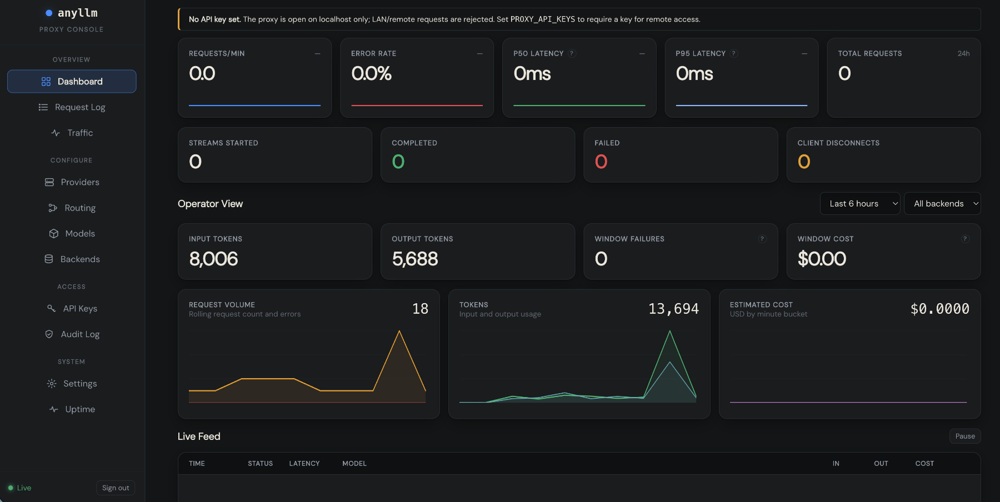
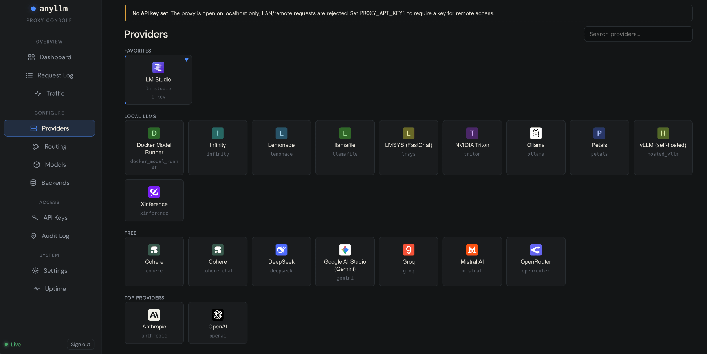

<p align="center">
  <pre style="display: inline-block; text-align: left;">
 █████╗ ███╗   ██╗██╗   ██╗██╗     ██╗     ███╗   ███╗
██╔══██╗████╗  ██║╚██╗ ██╔╝██║     ██║     ████╗ ████║
███████║██╔██╗ ██║ ╚████╔╝ ██║     ██║     ██╔████╔██║
██╔══██║██║╚██╗██║  ╚██╔╝  ██║     ██║     ██║╚██╔╝██║
██║  ██║██║ ╚████║   ██║   ███████╗███████╗██║ ╚═╝ ██║
╚═╝  ╚═╝╚═╝  ╚═══╝   ╚═╝   ╚══════╝╚══════╝╚═╝     ╚═╝

     ██████╗ ██████╗  ██████╗ ██╗  ██╗██╗   ██╗
     ██╔══██╗██╔══██╗██╔═══██╗╚██╗██╔╝╚██╗ ██╔╝
     ██████╔╝██████╔╝██║   ██║ ╚███╔╝  ╚████╔╝
     ██╔═══╝ ██╔══██╗██║   ██║ ██╔██╗   ╚██╔╝
     ██║     ██║  ██║╚██████╔╝██╔╝ ██╗   ██║
     ╚═╝     ╚═╝  ╚═╝ ╚═════╝ ╚═╝  ╚═╝   ╚═╝
  </pre>
</p>

[](https://github.com/whit3rabbit/anyllm-proxy/actions/workflows/ci.yml)
[](https://crates.io/crates/anyllm_translate)
[](https://github.com/whit3rabbit/anyllm-proxy/releases/latest)

<p align="center">
  
  
  <br />
  <em>The anyllm-proxy administration WebUI dashboard and settings.</em>
</p>

An API translation proxy that lets Anthropic-based tools (Claude Code, Cursor, Windsurf, Cline) talk to any OpenAI-compatible backend, local LLM, or alternative provider. Similar to ccrouter, it has equivilent providers with LiteLLM and includes other features like RTK, FFEC, and Forge Tool-Call Guardrails.

---

## Install

**macOS (Homebrew):**
```bash
brew install whit3rabbit/tap/anyllm-proxy
```

**Linux (Debian/Ubuntu):**
```bash
# Check https://github.com/whit3rabbit/anyllm-proxy/releases for the current filename
curl -LO https://github.com/whit3rabbit/anyllm-proxy/releases/latest/download/anyllm-proxy_0.16.0-1_amd64.deb
sudo dpkg -i anyllm-proxy_*.deb
sudo systemctl enable --now anyllm-proxy
# Configure: edit /etc/default/anyllm-proxy
```

**Binary (all platforms):** Download from the [releases page](https://github.com/whit3rabbit/anyllm-proxy/releases).

<details>
<summary>Other install methods</summary>

```bash
# Cargo
cargo install anyllm_proxy

# Build from source
cargo build -p anyllm_proxy --release

# Docker
docker run -d -p 3000:3000 -p 127.0.0.1:3001:3001 -e WEBUI=1 -e ADMIN_BIND=0.0.0.0 followthewhit3rabbit/anyllm-proxy:latest
```

</details>

---

## Quick Start (Easiest Method)

Running `anyllm-proxy` with **no arguments** is the easiest way to get started. It automatically launches the proxy server, starts the local administration dashboard, and opens it in your default web browser:

```bash
anyllm-proxy
# Proxy:     http://localhost:3000
# Admin UI:  http://127.0.0.1:3001/admin/ (opened automatically, token pre-filled)
```

1. **Configure in the WebUI:**
   - **Providers & Models:** Go to the **Backends** (Providers) tab, add your API key/endpoint (e.g., OpenAI, Gemini, Ollama), and assign it a model. If a provider is not directly listed, you can manually add the deployment details in the **Models** tab.
   - **Routing:** After setting up your provider and models, navigate to the **Routing** tab to assign them to routes. You can set up manual routes or enable the **Auto Router** (tailored specifically for Claude Code to handle model tiers dynamically).
2. **Point your tools at the Proxy:**
   - **Claude Code:**
     ```bash
     ANTHROPIC_BASE_URL=http://localhost:3000 ANTHROPIC_API_KEY=proxy-user claude
     ```
   - **Cursor / Cline / Windsurf:** Configure the custom Anthropic endpoint to point to `http://localhost:3000`.

### Custom Ports & Auth Token
By default, the proxy runs on port `3000` and the WebUI on port `3001`. You can customize these using the `LISTEN_PORT` and `ADMIN_PORT` environment variables:

```bash
LISTEN_PORT=4000 ADMIN_PORT=4001 anyllm-proxy
```

On first startup, the proxy prints the auto-generated admin auth token to the terminal (and saves it in `~/.anyllm/.admin_token`), which you can use to access the dashboard or authenticate admin API requests.

### Advanced Invocations
If you prefer running strictly via CLI flags, environment variables, or TOML/YAML config files, see [CLI Reference](docs/CLI.md).

---

## Superpowers (Configure in Settings)

You can toggle and configure advanced options directly within the **Settings** tab of the Admin WebUI:

*   **Providers & Models Catalog:** Integrated support for local LLMs (Ollama, LM Studio, vLLM) and commercial APIs (OpenAI, Gemini, Azure OpenAI, AWS Bedrock, OpenRouter). Discover and deploy models on the fly.
*   **Prompt Compression (FFEC):** Opt-in Frozen-Frontier Extractive Compression powered by LLMLingua-2. It analyzes conversation history to remove redundant words and tokens, saving input cost and fitting longer chats into context windows.
*   **RTK (Command-Aware Tool Compression):** Declutter tool outputs before they reach the model. RTK matches tool outputs against a declarative filter catalog to automatically strip noise from test runner output, build scripts, git status, and logs.
*   **Forge Tool-Call Guardrails:** Advisory guardrails that nudge Claude/models to utilize LSP-based tools over verbose shell commands, use quiet switches, and cap oversized file payloads.
*   **Thinking Block Repair:** For models with reasoning tokens (like Claude 3.7). Tracks thinking block tokens as ground truth and automatically repairs them if client-side applications corrupt or strip them during replay.

---

## Admin Web Interface

The admin WebUI (running on port `3001` by default) includes:

-   **Dashboard:** Real-time metrics (RPM, error rate, latency sparklines), per-backend cards, and a filterable live request feed.
-   **Request Log:** Paginated history with detailed query/response bodies, spend estimate tracking, and token usage breakdown.
-   **Access Control:** Create and manage Virtual Keys with monthly/daily budgets, RPM/TPM rate limits, and model allowlists.
-   **Routing:** Set up Model Routes (aliases with failovers/load-balancing) and the **Auto Router** (routes based on token length, images, or thinking configurations).
-   **Settings:** Easily edit runtime variables, import/export `.env` templates, and toggle superpowers.

---

## Features

-   **Streaming SSE:** Real-time translation of chunked responses.
-   **Tool Calling:** Seamless definition and `tool_use`/`tool_result` translation.
-   **Image and Document Blocks:** Full base64/URL and document block translation support.
-   **OpenAI Input Protocol:** Exposes a `POST /v1/chat/completions` endpoint for OpenAI-native clients.
-   **Embeddings Passthrough:** Forward `POST /v1/embeddings` to your configured backend.
-   **Safety and Security:** SSRF protection, concurrency limiting, admin CSRF tokens, and rate limits.
-   **OpenTelemetry:** Optional tracing export via OTLP (`--features otel`).

---

## Advanced Documentation

-   **[CLI Reference](docs/CLI.md)** — Config files, API keys environment setup, and Curl commands.
-   **[ENV Reference](docs/ENV.md)** — Full environment variable index.
-   **[Config Reference](docs/CONFIG.md)** — Local paths and file layout.
-   **[Library Integration](docs/library-integration.md)** — Using translation crates as libraries (`anyllm_translate` / `anyllm_client`).

---

## License

MIT
