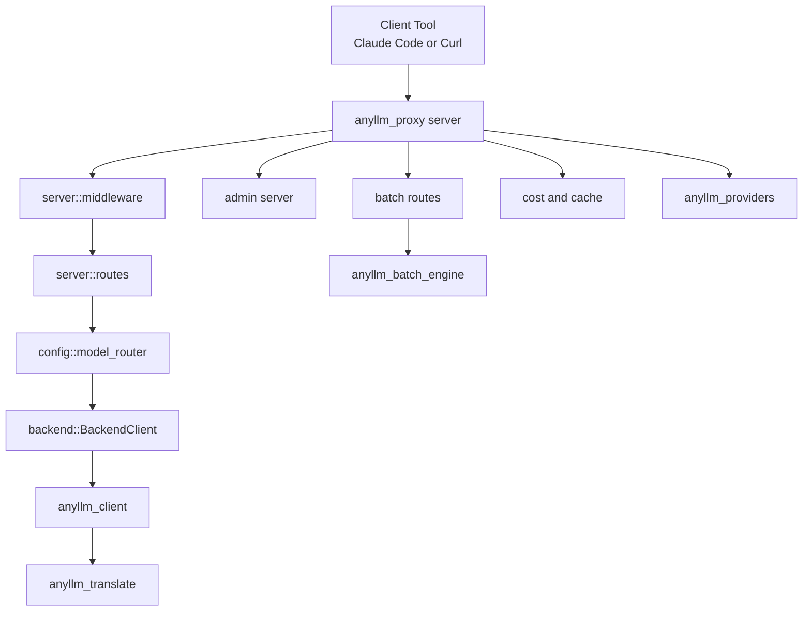
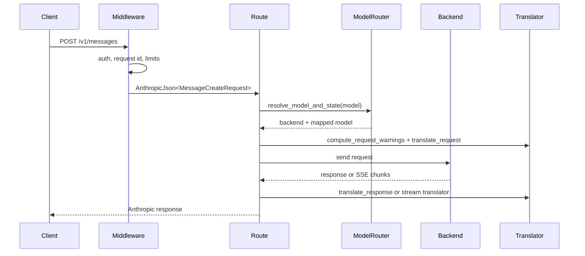

`anyllm-proxy` is deliberately split into IO-free and IO-owning layers. The workspace root `Cargo.toml` defines five crates, and the boundary between them is the main design decision that keeps translation logic testable while still supporting a large server feature set.

## Workspace Structure

- `crates/translator` is the pure mapping layer. `crates/translator/src/translate.rs` exposes top-level functions like `translate_request`, `translate_response`, and the streaming translator constructors. It owns the format conversions and nothing that touches sockets, files, or process state.
- `crates/client` adds transport. `crates/client/src/client.rs` wraps `reqwest`, retry logic, SSE decoding, and `TranslationConfig` so a Rust application can make Anthropic-style calls without running the full proxy.
- `crates/providers` is a static provider and model catalog. `crates/providers/src/registry.rs` resolves provider ids, aliases, LiteLLM prefixes, and default base URLs without any network or runtime dependency.
- `crates/batch_engine` owns durable batch state. `crates/batch_engine/src/engine.rs` coordinates a queue, file store, and webhook queue; `validation.rs` enforces the OpenAI batch JSONL contract before jobs are accepted.
- `crates/proxy` is the binary and reusable server/runtime layer. `crates/proxy/src/main.rs` boots env files, config discovery, admin state, and the axum routers defined in `crates/proxy/src/server/routes.rs`.

## Key Design Decisions

### 1. Translation stays IO-free

The most important boundary is between `anyllm_translate` and everything else. `crates/translator/src/lib.rs` only re-exports data types, mapping helpers, and stateful streaming translators. That keeps the hardest compatibility logic unit-testable with golden JSON fixtures instead of integration servers, and it is why both `anyllm_client` and `anyllm_proxy` can reuse the same conversion rules.

### 2. Transport is reusable, not server-bound

`crates/client/src/lib.rs` re-exports `Client`, `HttpClientConfig`, retry helpers, and tool builders. The proxy itself reuses pieces of that transport layer in `crates/proxy/src/backend/mod.rs`, especially the retry, SSE, and rate-limit parsing utilities. That avoids duplicating HTTP-hardening logic while still letting the server maintain provider-specific backends like Bedrock and Gemini native.

### 3. Configuration supports progressive complexity

`crates/proxy/src/config/mod.rs` loads three config modes: env-only single-backend config, simple YAML with `models:`, and LiteLLM-style YAML with `model_list:`. The README and `main.rs` both steer most users toward env vars first, then let advanced operators graduate to model routers, named backends, and admin-managed state without changing the request shape.

### 4. Routing is explicit, not magic service discovery

`crates/proxy/src/config/model_router.rs` stores a model name to deployment map and selects deployments with one of five routing strategies. The router only tracks what the proxy itself can observe: RPM counters, in-flight requests, latency EWMA, weights, and cost data. It does not attempt health probing or dynamic capability negotiation, which keeps the routing rules deterministic and auditable.

### 5. Admin and data-plane stay separate

The proxy server and admin server are distinct. `crates/proxy/src/server/routes.rs` builds the data-plane routes on the public listening port, while `crates/proxy/src/admin/` serves localhost-oriented management APIs, request logs, and WebSocket updates. This separation is why the public router can stay centered on translation and request forwarding, while admin features can safely depend on SQLite, audit trails, and mutable runtime config.

## Request Lifecycle

For non-streaming Messages requests, the main path is `server::routes` -> `server::state::AppState::resolve_model_and_state` -> `backend::BackendClient` -> `anyllm_translate::translate_response`. For streaming requests, `server/streaming.rs` and the translators in `crates/translator/src/mapping/streaming_map.rs` hold state across chunks so OpenAI or Gemini events can be re-emitted as Anthropic SSE.

Batch requests follow a different path. `crates/proxy/src/batch/routes.rs` validates the uploaded JSONL file, stores it through `anyllm_batch_engine::file_store`, turns each line into `SubmissionItem`, and asks `BatchEngine::submit` to enqueue durable work. Completion and cancellation events are then handed off to the webhook queue rather than being pushed directly inside request handlers.

## How The Pieces Fit Together

- Startup begins in `crates/proxy/src/main.rs`, which resolves `ANYLLM_HOME`, loads `.anyllm.env`, applies env imports from SQLite, auto-detects `config.yaml`, and only then starts the Tokio runtime. That order is intentional because `set_var` is only used while the process is still single-threaded.
- `MultiConfig::load` in `crates/proxy/src/config/mod.rs` decides whether the proxy runs in legacy env mode, simple YAML mode, LiteLLM YAML mode, or TOML mode. If a model router is created, it is stored behind an `RwLock` so the admin UI can mutate routing state at runtime.
- `app_multi_with_shared` in `crates/proxy/src/server/routes.rs` builds one `AppState` per backend and nests named backend routers under `/{backend}` while also mounting the default backend on the unprefixed routes for compatibility.
- `AppState` in `crates/proxy/src/server/state.rs` is the handoff object between server concerns. It carries the backend client, concurrency semaphore, runtime config, cache, optional model router, tool engine, and batch engine.
- Backend transport is selected by enum variant in `crates/proxy/src/backend/mod.rs`. OpenAI-compatible backends share the same client path, while Anthropic, Bedrock, and Gemini native use dedicated implementations because their auth, wire format, or streaming format differs materially.
