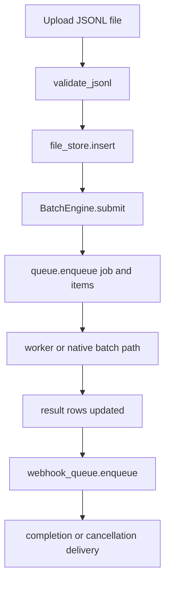

Batch execution is the workspace's durable asynchronous path. It exists so large collections of chat-completion requests can be uploaded once, processed in the background, and retrieved later through OpenAI-style and Anthropic-style batch endpoints.



## What It Solves

The batch API decouples request acceptance from request execution. `crates/batch_engine/src/validation.rs` enforces the input contract before persistence. `crates/batch_engine/src/engine.rs` creates durable `BatchJob` and `BatchItem` records. `crates/proxy/src/batch/routes.rs` exposes the HTTP surface without embedding queue, file, or webhook logic into the router itself.

## How It Relates To Other Concepts

- It uses the same backend configuration and routing system as [Routing And Backends](/docs/routing-and-backends).
- It reuses translation logic when batch items originate from Anthropic-style requests.
- It is one of the main reasons the workspace includes the separate `anyllm_batch_engine` crate instead of keeping all logic inside the proxy binary.

## How It Works Internally

`validate_jsonl` accepts `impl std::io::BufRead` and rejects files that are empty, larger than 100 MB, longer than 50,000 non-blank lines, missing `custom_id`, using duplicate `custom_id`, or lacking `body.model`. That is the first gate.

After upload, `BatchEngine::submit` checks that the referenced `input_file_id` exists in `FileStore`, creates a `BatchJob`, expands `SubmissionItem` into concrete `BatchItem` rows, enqueues them through the configured `JobQueue`, and emits a `batch.queued` webhook event. The engine stays generic over queue and webhook traits, but the workspace ships SQLite-backed reference implementations that the proxy uses by default.

`ExecutionMode` determines how the batch is processed:

- `ExecutionMode::Native { provider }` means the backend itself can own batch processing.
- `ExecutionMode::ProxyNative` means the proxy will process items individually against the configured backend.

## Basic Usage

Validate a file before accepting it:

```rust
use anyllm_batch_engine::validate_jsonl;
use std::io::Cursor;

let input = br#"{"custom_id":"a","body":{"model":"gpt-4o-mini"}}
{"custom_id":"b","body":{"model":"gpt-4o-mini"}}"#;

let validated = validate_jsonl(Cursor::new(&input[..]))?;
assert_eq!(validated.line_count, 2);
# Ok::<(), String>(())
```

## Advanced Usage

Submit a batch directly against the engine:

```rust
use anyllm_batch_engine::{
    BatchEngine, BatchSubmission, ExecutionMode, SourceFormat, SubmissionItem
};
use anyllm_batch_engine::db::init_batch_engine_tables;
use anyllm_batch_engine::file_store::FileStore;
use anyllm_batch_engine::queue::sqlite::SqliteQueue;
use anyllm_batch_engine::webhook::sqlite::SqliteWebhookQueue;
use rusqlite::Connection;
use std::sync::{Arc, Mutex};

let conn = Connection::open_in_memory()?;
init_batch_engine_tables(&conn)?;
let db = Arc::new(Mutex::new(conn));

let engine = BatchEngine {
    queue: Arc::new(SqliteQueue::new(db.clone())),
    file_store: FileStore::new(db.clone()),
    webhook_queue: Arc::new(SqliteWebhookQueue::new(db)),
    global_webhook_urls: vec!["https://hooks.example.com/batch".into()],
    webhook_signing_secret: Some("secret".into()),
};

engine.file_store
    .insert("file-demo", None, None, b"{"custom_id":"a","body":{"model":"gpt-4o-mini"}}", 1)
    .await?;

let job = engine.submit(BatchSubmission {
    items: vec![SubmissionItem {
        custom_id: "a".into(),
        model: "gpt-4o-mini".into(),
        body: serde_json::json!({"messages":[{"role":"user","content":"hello"}]}),
        source_format: SourceFormat::OpenAI,
    }],
    execution_mode: ExecutionMode::ProxyNative,
    input_file_id: "file-demo".into(),
    key_id: None,
    webhook_url: None,
    metadata: None,
    priority: 0,
}).await?;

assert_eq!(job.request_counts.total, 1);
# Ok::<(), Box<dyn std::error::Error>>(())
```

<Callout type="warn">Batch uploads fail early if the referenced input file is missing or if the JSONL contract is violated. The proxy does not try to "repair" bad input by inventing `custom_id` values or guessing a `body.model`; those errors are intentionally fatal so the queue stays deterministic.</Callout>

<Accordions>
<Accordion title="Native Batch vs Proxy-Native Batch">
`ExecutionMode::Native` lets the upstream provider own the heavy lifting, which can reduce proxy-side work and align better with provider billing or lifecycle semantics. `ExecutionMode::ProxyNative` keeps control inside your own deployment and works even when the provider does not ship a native batch API, but it also means your proxy is responsible for concurrency, retries, logging, and result assembly. The code in `crates/proxy/src/batch/routes.rs` chooses the mode based on backend capability, not on a hidden heuristic. That keeps the decision visible and predictable for operators reading logs or debugging queue behavior.
</Accordion>
<Accordion title="SQLite Reference Implementations vs Custom Backends">
The crate's public `BatchEngine<Q, W>` is generic because queueing and webhook persistence are business-specific integration points. The bundled SQLite implementations are a strong default because they are easy to embed, transactional, and require no external services, which is ideal for the proxy binary and for most single-node deployments. If you need Postgres, Redis, or a managed queue, you can implement the queue traits without forking the engine logic. The trade-off is that the reference implementation is deliberately conservative: it favors predictability and local durability over distributed throughput.
</Accordion>
</Accordions>
