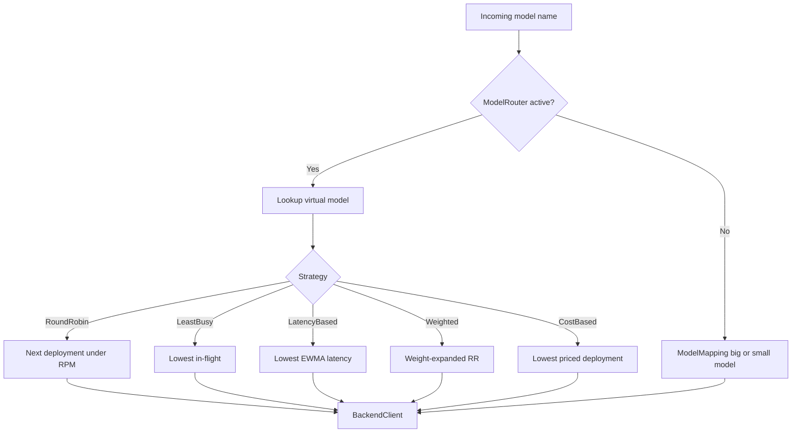

Routing is the layer that turns a user-facing model name into a concrete backend and upstream model id. It exists because the proxy supports everything from one local Ollama instance to many named backends with multiple deployments per virtual model.



## What It Solves

The proxy needs to handle two very different operator needs:

- simple mode, where Anthropic aliases like "haiku" or "sonnet" just map to one configured backend model through `ModelMapping`, and
- advanced mode, where `model_list` or simple YAML config can expose multiple virtual models, weights, RPM limits, and named backends.

This logic lives mostly in `crates/proxy/src/config/model_router.rs`, `crates/proxy/src/server/state.rs`, and `crates/proxy/src/runtime.rs`.

## How It Relates To Other Concepts

- It depends on [Configuration And Modes](/docs/configuration-and-modes) because config files decide whether a `ModelRouter` exists at all.
- It consumes translated request data from [Translation Pipeline](/docs/translation-pipeline).
- It affects batch execution because `ExecutionMode::Native` vs `ExecutionMode::ProxyNative` is selected based on backend support.

## How It Works Internally

`ModelRouter` stores `HashMap<String, Vec<Arc<Deployment>>>`, where each virtual model name maps to one or more deployments. Each `Deployment` tracks:

- `backend_name`
- `actual_model`
- optional RPM and TPM limits
- a weight value
- approximate 60-second tumbling counters
- in-flight request count
- latency EWMA

When `AppState::resolve_model` in `crates/proxy/src/server/state.rs` sees a router, it asks the router for a `RoutedDeployment`. If the router returns `None` but the model exists, the proxy treats that as "all deployments are at their RPM limit" and returns a 429. If the model does not exist at all, the proxy returns an Anthropic-shaped 400.

If there is no router, the fallback path is `ModelMapping::map_model` from `crates/proxy/src/config/mod.rs`. That simple mapping uses substring checks: "haiku" selects `SMALL_MODEL`, while "sonnet" and "opus" select `BIG_MODEL`.

## Basic Usage

Single-backend env mode:

```bash
BACKEND=groq
GROQ_API_KEY=gsk_...
BIG_MODEL=llama-3.3-70b-versatile
SMALL_MODEL=llama-3.1-8b-instant
PROXY_API_KEYS=proxy-user
```

In this mode, `Config::from_env` creates one backend and `ModelMapping::map_model` chooses between the `BIG_MODEL` and `SMALL_MODEL` values. No named backend prefixes or deployment-level counters are involved.

## Advanced Usage

Simple YAML with two deployments and latency-aware routing:

```yaml
routing_strategy: latency-based
models:
  - name: claude-3-5-sonnet-latest
    model: gpt-4o
    provider: openai
    api_key: env:OPENAI_API_KEY
    api_base: https://api.openai.com
    rpm: 120
  - name: claude-3-5-sonnet-latest
    model: llama-3.3-70b-versatile
    provider: groq
    api_key: env:GROQ_API_KEY
    api_base: https://api.groq.com/openai/v1
    rpm: 300
```

Under the hood, `parse_simple_yaml` in `crates/proxy/src/config/simple.rs` normalizes each entry into a backend definition plus a `Deployment`. Then `ModelRouter::with_strategy` chooses the selection policy for every request to the virtual model name.

<Callout type="warn">Routing only knows what the proxy observes locally. The latency-based and least-busy strategies do not actively probe backend health, and the RPM limiter in `ModelRouter` is an approximate in-memory window. If you need hard global limits across proxy instances, use the Redis-backed rate limiting features instead of assuming the router enforces cluster-wide fairness.</Callout>

<Accordions>
<Accordion title="Choosing A Routing Strategy">
`RoundRobin` is the safest default because it is deterministic and cheap. `LeastBusy` reacts quickly to load spikes because it uses the current in-flight counter, while `LatencyBased` uses an EWMA that smooths noisy samples and gradually favors faster deployments. `Weighted` is useful when one backend is intentionally more expensive or more powerful and should take a larger share of traffic without taking everything. `CostBased` is attractive for budget-sensitive routing, but it depends on pricing data being present for every deployment model; otherwise it falls back to round-robin behavior.
</Accordion>
<Accordion title="Stub Providers vs Native Backends">
Most providers in `anyllm_providers` are OpenAI-compatible stubs, which means `resolve_backend` maps them back onto the OpenAI client path in `crates/proxy/src/backend/mod.rs`. That is why `BACKEND=groq` or `BACKEND=openrouter` can work without custom backend code. Native backends like Anthropic, Bedrock, and Gemini native need dedicated implementations because the auth model, endpoint shape, or streaming format differs too much for a simple OpenAI-compatible adapter. The benefit of the stub model is breadth: the catalog can grow quickly without forcing the proxy to ship a distinct client for every provider id.
</Accordion>
</Accordions>
