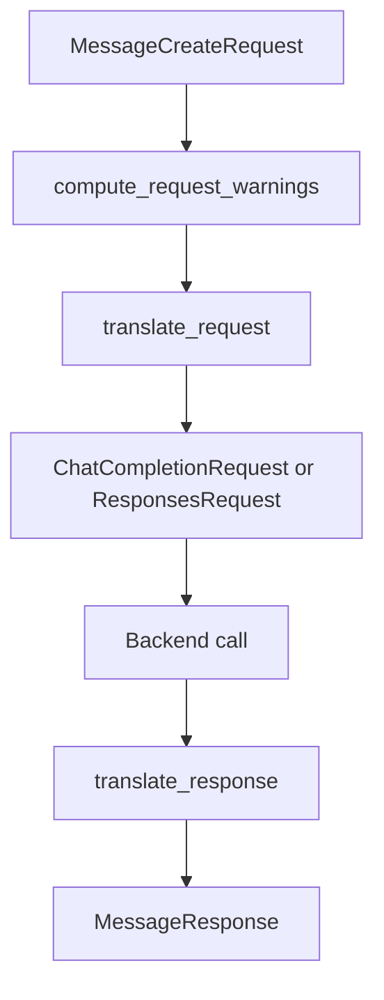

The translation pipeline is the core abstraction in this workspace. It exists so Anthropic-shaped clients can keep speaking Anthropic even when the upstream backend only understands OpenAI Chat Completions, OpenAI Responses, or Gemini native `generateContent`.



## What It Solves

`anyllm_translate` keeps the compatibility logic in one place. `crates/translator/src/config.rs` handles model mapping rules and lossy-feature policy, while `crates/translator/src/translate.rs` exposes the thin public entry points that other crates call. This separation means the same rules are used whether you are inside `anyllm_client`, inside `anyllm_proxy`, or building your own Rust wrapper.

The pipeline also makes translation degradations explicit. `compute_request_warnings` returns a `TranslationWarnings` object before conversion, which is later surfaced by the proxy as `x-anyllm-degradation` when advanced mode enables it. That is important because not every Anthropic feature has a first-class OpenAI equivalent.

## How It Relates To Other Concepts

- It depends on [Configuration And Modes](/docs/configuration-and-modes) because `TranslationConfig` controls model mapping and strictness.
- It feeds [Routing And Backends](/docs/routing-and-backends) because the translated request must target a resolved backend and a mapped model id.
- It is reused by the client and runtime API pages in [API Reference](/docs/api-reference/anyllm-translate).

## How It Works Internally

`crates/translator/src/lib.rs` re-exports the stable public surface. The important functions live in `crates/translator/src/translate.rs`:

- `translate_request` calls `message_map::anthropic_to_openai_request`, then replaces the resulting `model` with `TranslationConfig::map_model`.
- `translate_response` converts a `ChatCompletionResponse` back into `MessageResponse`, preserving the original Anthropic model name in the final payload.
- `translate_request_responses` and `translate_response_responses` do the same for the OpenAI Responses API.
- `translate_request_gemini` returns both a `GenerateContentRequest` and the mapped model string, because Gemini native requests use the model in the URL path rather than inside the JSON body.

Streaming is stateful by design. `new_stream_translator`, `new_responses_stream_translator`, `new_reverse_stream_translator`, and `new_gemini_stream_translator` each wrap a state machine in `crates/translator/src/mapping/*streaming_map.rs`. They buffer partial tool call arguments, message boundaries, and finish reasons so downstream clients see Anthropic-style event ordering even when the upstream stream uses a different chunk grammar.

## Basic Usage

```rust
use anyllm_translate::{TranslationConfig, translate_request, translate_response};
use anyllm_translate::anthropic::MessageCreateRequest;
use anyllm_translate::openai::ChatCompletionResponse;

let config = TranslationConfig::builder()
    .model_map("haiku", "gpt-4o-mini")
    .model_map("sonnet", "gpt-4o")
    .build();

let request: MessageCreateRequest = serde_json::from_str(r#"{
  "model": "claude-3-5-sonnet-latest",
  "max_tokens": 128,
  "messages": [{"role": "user", "content": "Hello"}]
}"#)?;

let upstream = translate_request(&request, &config)?;

let response: ChatCompletionResponse = serde_json::from_str(r#"{
  "id": "chatcmpl_1",
  "object": "chat.completion",
  "model": "gpt-4o",
  "choices": [{
    "index": 0,
    "message": {"role": "assistant", "content": "Hi"},
    "finish_reason": "stop"
  }],
  "usage": {"prompt_tokens": 12, "completion_tokens": 3, "total_tokens": 15}
}"#)?;

let anthropic = translate_response(&response, &request.model);
assert_eq!(upstream.model, "gpt-4o");
assert_eq!(anthropic.model, "claude-3-5-sonnet-latest");
# Ok::<(), Box<dyn std::error::Error>>(())
```

## Advanced Usage

```rust
use anyllm_translate::{
    TranslationConfig, compute_request_warnings, new_stream_translator, translate_request
};
use anyllm_translate::anthropic::MessageCreateRequest;
use anyllm_translate::openai::ChatCompletionChunk;

let config = TranslationConfig::builder()
    .model_map("sonnet", "gpt-4o")
    .passthrough_unknown_models(false)
    .build();

let request: MessageCreateRequest = serde_json::from_str(r#"{
  "model": "claude-3-5-sonnet-latest",
  "max_tokens": 256,
  "stream": true,
  "tools": [{
    "name": "get_weather",
    "input_schema": {"type": "object"}
  }],
  "messages": [{"role": "user", "content": "Weather?"}]
}"#)?;

let warnings = compute_request_warnings(&request);
let translated = translate_request(&request, &config)?;
let mut stream = new_stream_translator(request.model.clone());

let chunk: ChatCompletionChunk = serde_json::from_str(r#"{
  "id": "chatcmpl_1",
  "object": "chat.completion.chunk",
  "model": "gpt-4o",
  "choices": [{
    "index": 0,
    "delta": {"role": "assistant", "content": "Checking"},
    "finish_reason": null
  }]
}"#)?;

let events = stream.process_chunk(&chunk)?;
assert!(warnings.header_value().is_some() || warnings.is_empty());
assert_eq!(translated.model, "gpt-4o");
assert!(!events.is_empty());
# Ok::<(), Box<dyn std::error::Error>>(())
```

<Callout type="warn">`translate_response` needs the original Anthropic model name, not the mapped backend model. If you pass the backend model instead, clients will see the wrong model in the final `MessageResponse`, which becomes confusing when you are routing multiple Anthropic aliases to the same upstream deployment.</Callout>

<Accordions>
<Accordion title="Strict Mapping vs Passthrough Unknown Models">
`TranslationConfig::map_model` performs ordered, case-insensitive substring matching. When `passthrough_unknown_models` is `true`, unmatched models are forwarded unchanged, which is convenient for fast experimentation and for providers that already accept Anthropic-style names. The trade-off is that a typo can silently reach the backend and fail there instead of failing early in your code. Setting `passthrough_unknown_models(false)` gives you earlier feedback and cleaner operator behavior, but it also means every new model alias must be intentionally registered before requests can flow.

```rust
let config = TranslationConfig::builder()
    .model_map("sonnet", "gpt-4o")
    .passthrough_unknown_models(false)
    .build();
```

</Accordion>
<Accordion title="Chat Completions vs Responses vs Gemini Native">
The crate exposes multiple entry points because the target APIs are not interchangeable. `translate_request` and `translate_response` target OpenAI Chat Completions, which is the default path throughout the proxy and client crates. `translate_request_responses` and `translate_response_responses` exist for backends that prefer the newer Responses API, while `translate_request_gemini` must return a tuple because Gemini native moves model selection into the request URL. Choosing one path per backend keeps each converter honest, but it also means application code has to decide which upstream shape it is integrating with before it sends the request.
</Accordion>
</Accordions>
